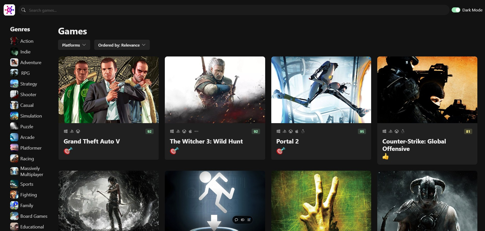
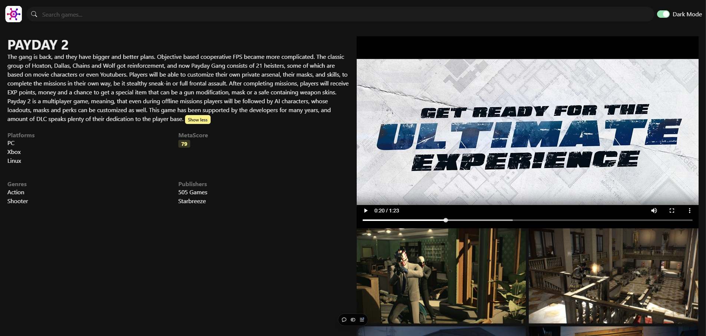
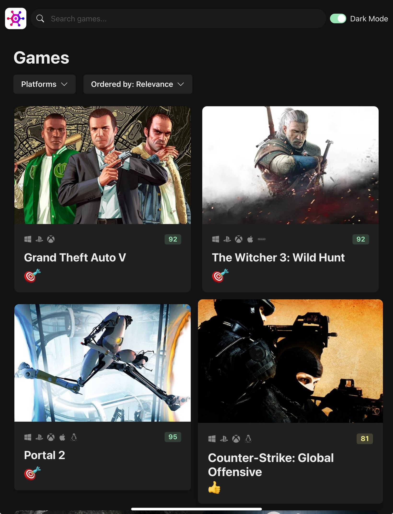
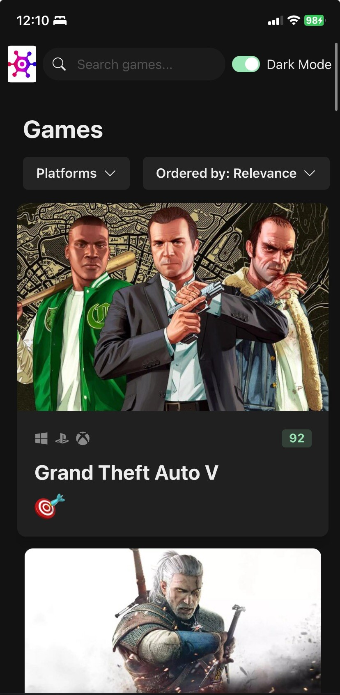

# Game Hub

Welcome to **Game Hub**, a web app designed to be your ultimate guide to discovering exciting games across multiple platforms—PC, PlayStation, Xbox, Android, Linux, Nintendo, and more. Powered by the RAWG Video Games Database API, **Game Hub** offers detailed insights into thousands of games, including platform compatibility, ratings, descriptions, and more. Effortlessly search by platform, genre, keyword, and more to find your next gaming adventure. Dive in and explore your new favorite games with **Game Hub!**

## Table of Contents

- [Demo](#demo)
- [Features](#features)
- [Technologies Used](#technologies-used)
- [Setup and Installation](#setup-and-installation)
- [Usage](#usage)
- [Contributing](#contributing)
- [License](#license)

## Demo

Check out the live application here: [Game Hub on Vercel](https://anthonyiheonye.com/)

#### Laptop




#### Tablet



#### Mobile



## Features

- Search for games by title or filter by platform.
- View details for each game, including release date, genres, ratings, and platforms.
- Responsive design for a seamless experience across devices.
- Real-time data fetched from the RAWG API.

## Technologies Used

- **Frontend**: React, TypeScript, Chakra UI for styling
- **Backend/API**: RAWG Video Games Database API
- **Deployment**: Vercel for hosting
- **Version Control**: Git and GitHub

## Setup and Installation

1. **Clone the repository**:

   ```bash
   git clone https://github.com/anthony-iheonye/game-hub.git
   cd game-hub

   ```

2. **Install dependencies**

   ```bash
   npm install

   ```

3. **API Key Configuration:**

   - Sign up on [RAWG](https://rawg.io/apidocs) and obtain your API key.
   - Add the API key to **src/services/api-clients.ts.**
     or
   - Create a .env file in the root directory and add your RAWG API key:
     ```env
     REACT_APP_RAWG_API_KEY=your_api_key_here
     ```

4. **Run web app**

   Run `npm run dev` to start the web server.

## Usage

- **Search**: Look up games by name or filter by platform and genre.
- **Sort**: Arrange games by relevance, name, date added, release date, popularity, and rating.

## Contributing

Contributions are welcome! Please fork this repository and open a pull request if you would like to contribute.

## License

This project is licensed under the MIT License.

## Author

Developed by [Anthony Iheonye](https://github.com/anthony-iheonye) | [LinkedIn](https://www.linkedin.com/in/anthony-iheonye/)
